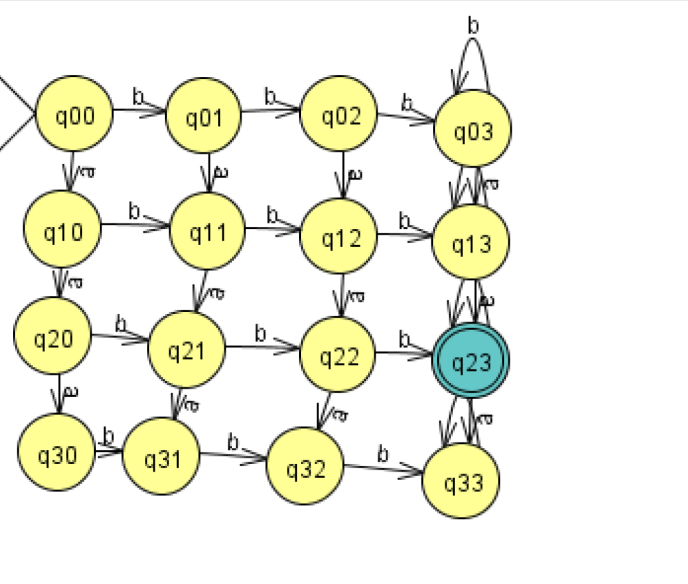
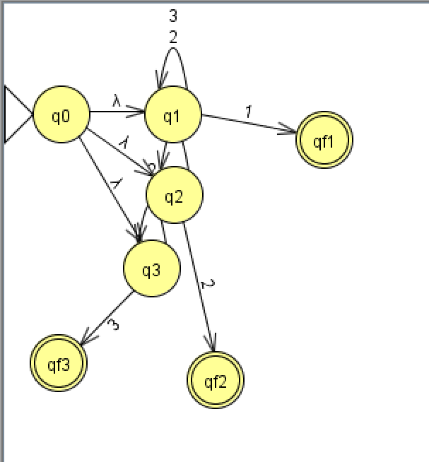
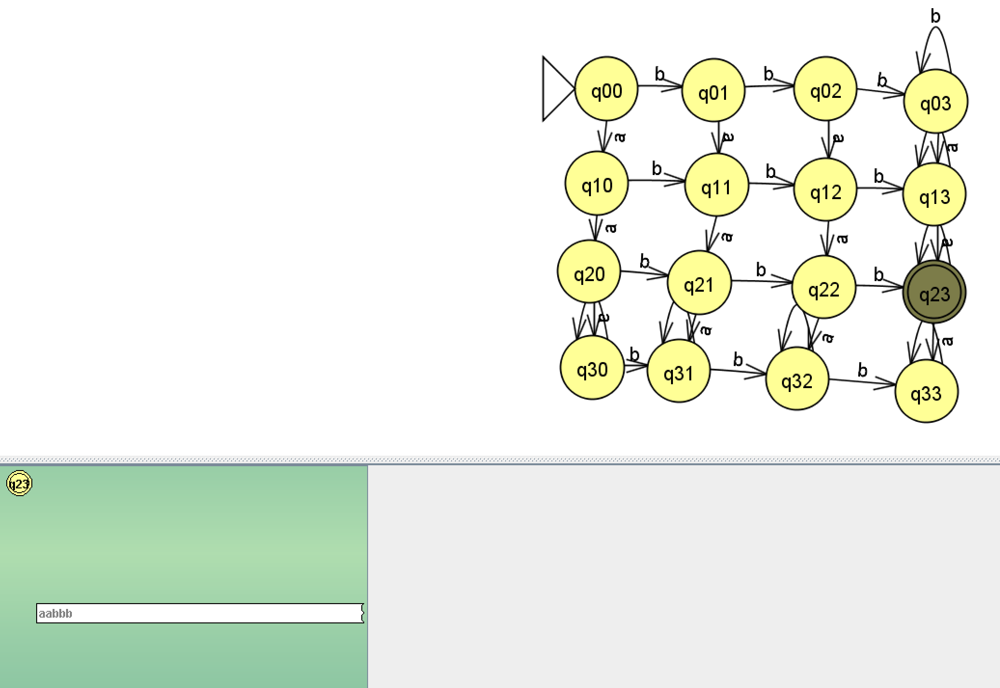
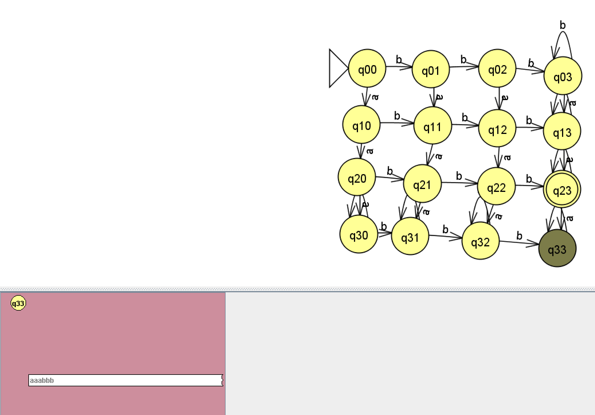
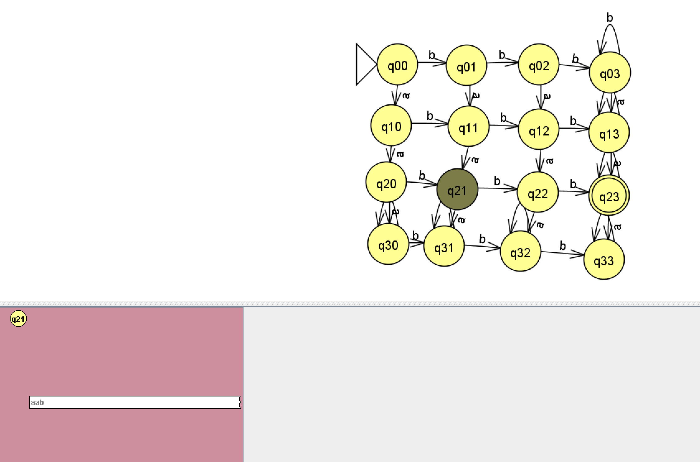
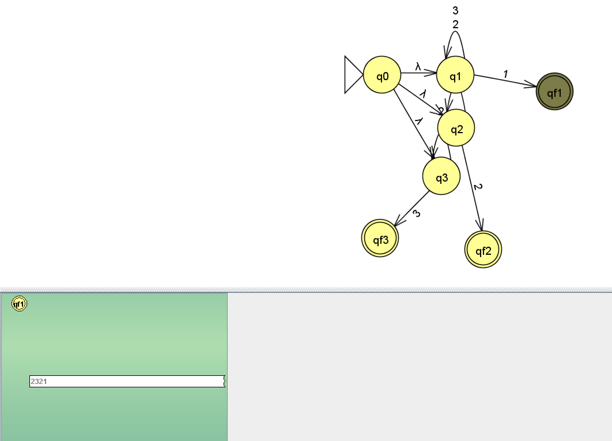
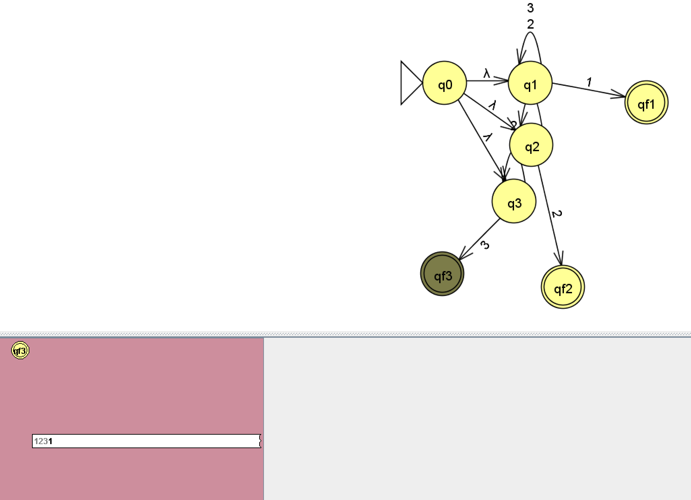
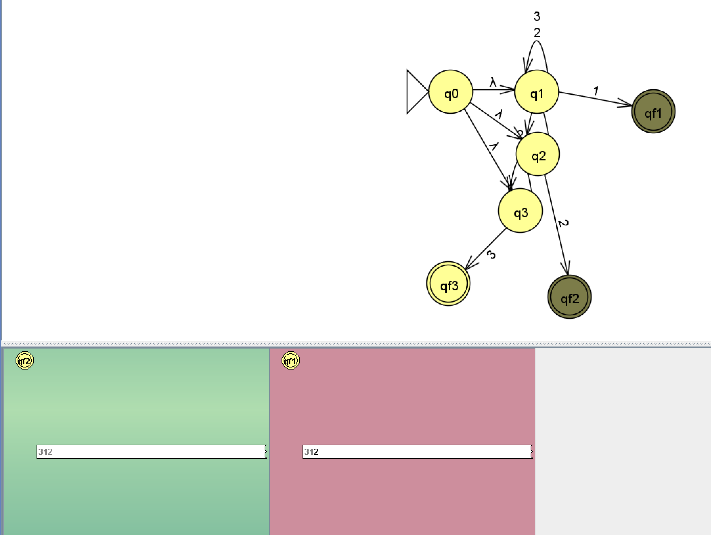

Министерство науки и высшего образования РФ 
Федеральное государственное автономное 
образовательное учреждение высшего образования 
<b>«СИБИРСКИЙ ФЕДЕРАЛЬНЫЙ УНИВЕРСИТЕТ»</b>

Институт космических и информационных технологий 
<u>институт</u> 
<b>Программная инженерия</b> 
<u>кафедра</u>

     

<b>ОТЧЁТ О ЛАБОРАТОРНОЙ РАБОТЕ №1</b>  
<u>Реализация и исследование детерминированных и недетерминированных конечных автоматов</u> 
<u>тема</u>

       

| | | |
|---|---|---|
| Преподаватель | _______________ | Кузнецов А. С. |
| | <small>подпись, дата</small> | <small>инициалы, фамилия</small> |
| Студент гр. КИ24-16/1Б, з/к 032429094 | _______________ | Н. А. Арсенян |
| | <small>подпись, дата</small> | <small>инициалы, фамилия</small> |

---

## 1. Цель работы

Реализация и исследование детерминированных и недетерминированных конечных автоматов.

---

## 2. Постановка задачи (Вариант 2)

### а) ДКА
Построить ДКА, допускающий в алфавите {a, b} все строки, где количество символов **a равно 2**, и количество символов **b больше 2**.

### б) НКА
Построить НКА, допускающий цепочки в алфавите Z = {1, 2, 3}, у которых **последний символ цепочки не появлялся в ней раньше**, например w = 2321.

---

## 3. Графы переходов

### 3.1 ДКА

**Алфавит:** {a, b}

**Состояния:** (ca, cb), где:
- ca — количество символов 'a' (0, 1, 2, 3+), где 3+ означает "3 или больше"
- cb — количество символов 'b' (0, 1, 2, 3+)

**Начальное состояние:** (0, 0)

**Принимающее состояние:** (2, 3) — ровно 2 символа 'a' и 3+ символов 'b'

**Таблица переходов:**

| Состояние | a       | b       |
|-----------|---------|---------|
| (0,0)     | (1,0)   | (0,1)   |
| (0,1)     | (1,1)   | (0,2)   |
| (0,2)     | (1,2)   | (0,3)   |
| (0,3)     | (1,3)   | (0,3)   |
| (1,0)     | (2,0)   | (1,1)   |
| (1,1)     | (2,1)   | (1,2)   |
| (1,2)     | (2,2)   | (1,3)   |
| (1,3)     | (2,3)   | (1,3)   |
| (2,0)     | (3,0)   | (2,1)   |
| (2,1)     | (3,1)   | (2,2)   |
| (2,2)     | (3,2)   | (2,3)   |
| (2,3)     | (3,3)   | (2,3)   |
| (3,0)     | (3,0)   | (3,1)   |
| (3,1)     | (3,1)   | (3,2)   |
| (3,2)     | (3,2)   | (3,3)   |
| (3,3)     | (3,3)   | (3,3)   |

**Граф ДКА:**

---

### 3.2 НКА

**Алфавит:** {1, 2, 3}

**Состояния:**
- q0 — начальное
- q_1, q_2, q_3 — промежуточные (угаданный последний символ)
- qf_1, qf_2, qf_3 — принимающие

**Начальное состояние:** q0

**Принимающие состояния:** qf_1, qf_2, qf_3

**Таблица переходов:**

| Состояние | ε              | 1        | 2        | 3        |
|-----------|----------------|----------|----------|----------|
| q0        | {q_1, q_2, q_3}| —        | —        | —        |
| q_1       | —              | {qf_1}   | {q_1}    | {q_1}    |
| q_2       | —              | {q_2}    | {qf_2}   | {q_2}    |
| q_3       | —              | {q_3}    | {q_3}    | {qf_3}   |
| qf_1      | —              | —        | —        | —        |
| qf_2      | —              | —        | —        | —        |
| qf_3      | —              | —        | —        | —        |

**Граф НКА:**

---

## 4. Пошаговое выполнение

### 4.1 ДКА: цепочка "aabbb" — ПРИНЯТА

**Путь состояний:**
(0,0) → (1,0) → (2,0) → (2,1) → (2,2) → (2,3) ✅

Пояснение: 2 символа 'a' и 3 символа 'b' — условие выполнено.

---

### 4.2 ДКА: цепочка "aaabbb" — ОТВЕРГНУТА

**Путь состояний:**
(0,0) → (1,0) → (2,0) → (3,0) → (3,1) → (3,2) → (3,3) ❌

Пояснение: 3 символа 'a' — больше допустимого (нужно ровно 2).

---

### 4.3 ДКА: цепочка "aab" — ОТВЕРГНУТА

**Путь состояний:**
(0,0) → (1,0) → (2,0) → (2,1) ❌

Пояснение: 2 символа 'a' (ок), но только 1 символ 'b' (нужно больше 2).

---

### 4.4 НКА: цепочка "2321" — ПРИНЯТА

**Множества состояний по шагам:**
- Старт (ε-замыкание): {q0, q_1, q_2, q_3}
- После '2': {q_1, qf_2, q_3}
- После '3': {q_1, qf_3}
- После '2': {q_1}
- После '1': {qf_1} ✅

Пояснение: последний символ '1' не встречался ранее в строке.

---

### 4.5 НКА: цепочка "1231" — ОТВЕРГНУТА

**Множества состояний по шагам:**
- Старт (ε-замыкание): {q0, q_1, q_2, q_3}
- После '1': {q_2, q_3, qf_1}
- После '2': {qf_2, q_3}
- После '3': {qf_3}
- После '1': {} ❌

Пояснение: последний символ '1' уже встречался в начале строки.

---

### 4.6 НКА: цепочка "312" — ПРИНЯТА

**Множества состояний по шагам:**
- Старт (ε-замыкание): {q0, q_1, q_2, q_3}
- После '3': {q_2, q_1, qf_3}
- После '1': {q_2, qf_1}
- После '2': {qf_2} ✅

Пояснение: все символы разные, последний '2' не встречался ранее.

